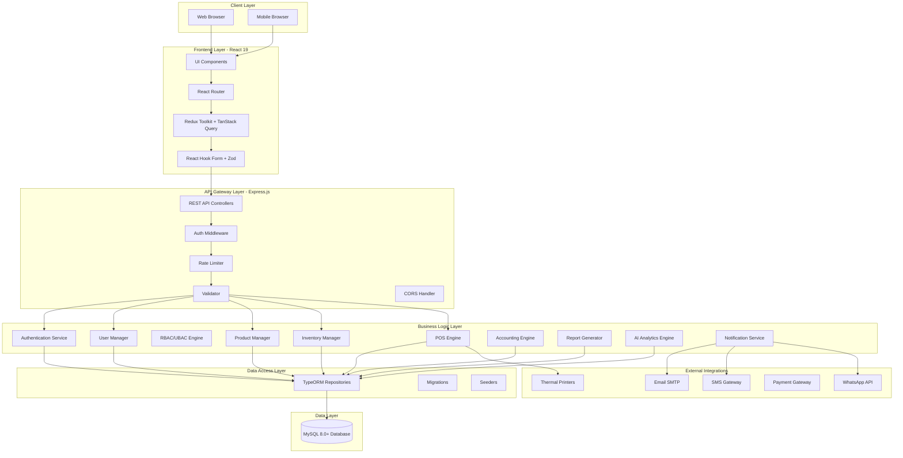
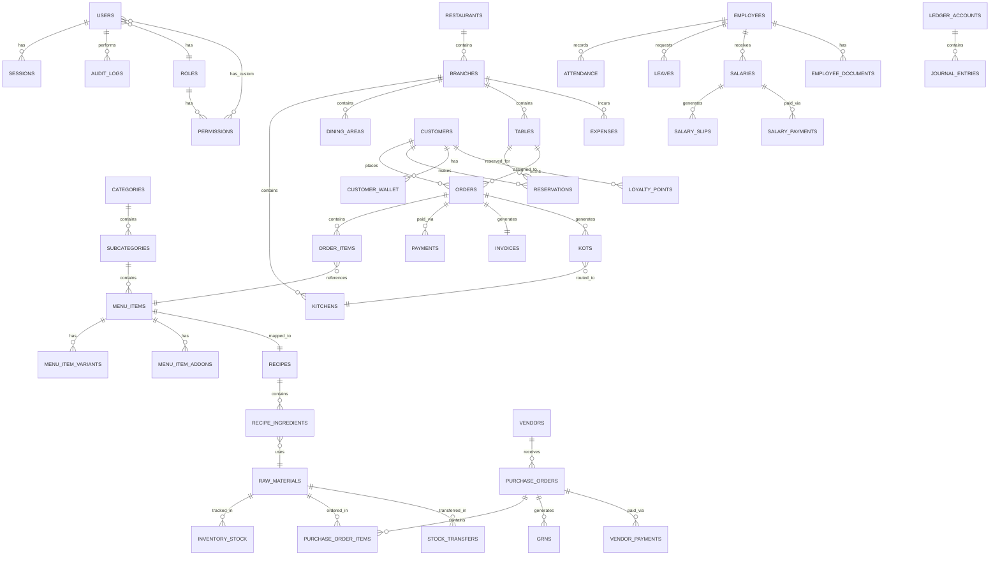

# Design Document: Restaurant ERP + POS Management System

## Overview

The Restaurant ERP + POS Management System is an enterprise-grade, full-stack web application designed to manage all operational aspects of restaurant businesses across multiple formats (Veg/Non-Veg, Cafes, Fast Food, Multi-Cuisine, Cloud Kitchens, Fine Dining, Multi-Branch). The system architecture follows a modern three-tier pattern with clear separation of concerns, enabling scalability, maintainability, and testability.

### System Objectives

- **Comprehensive Operations Management**: Handle all aspects from inventory and purchases to sales, accounting, and HR
- **Multi-Restaurant Support**: Support multiple restaurant types and branch operations from a unified platform
- **Real-Time Operations**: Provide live kitchen displays, table management, and order tracking
- **Enterprise Security**: Implement JWT authentication, RBAC/UBAC authorization, and comprehensive audit logging
- **Performance at Scale**: Support 1000+ concurrent users and 10M+ database records
- **Business Intelligence**: Deliver predictive analytics and comprehensive reporting

### Key Architectural Principles

1. **Separation of Concerns**: Clear layering (Presentation, Business Logic, Data Access)
2. **Security by Design**: Authentication, authorization, encryption, and audit logging at every layer
3. **Scalability First**: Stateless backend, connection pooling, caching, and horizontal scaling support
4. **Data Integrity**: Transactional operations, foreign key constraints, and soft deletes
5. **Observability**: Structured logging, audit trails, and performance monitoring
6. **Type Safety**: TypeScript across frontend and backend for compile-time error detection

## Architecture

### High-Level Architecture



### Technology Stack

#### Frontend Stack

| Layer | Technology | Version | Purpose |
|-------|-----------|---------|---------|
| Framework | React | 19 | UI component library |
| Language | TypeScript | 5.x | Type-safe JavaScript |
| Build Tool | Vite | 5.x | Fast build and HMR |
| Styling | TailwindCSS | 3.x | Utility-first CSS |
| Routing | React Router | 6.x | Client-side routing |
| State Management | Redux Toolkit | 2.x | Global app state |
| Server State | TanStack Query | 5.x | API data caching and sync |
| Forms | React Hook Form | 7.x | Form state management |
| Validation | Zod | 3.x | Schema validation |
| HTTP Client | Axios | 1.x | API communication |
| Charts | Chart.js / Recharts | - | Data visualization |
| Tables | React Table | 8.x | Data grids |
| PDF | React PDF | - | PDF generation |
| Animation | Framer Motion | - | UI animations |

#### Backend Stack

| Layer | Technology | Version | Purpose |
|-------|-----------|---------|---------|
| Runtime | Node.js | 18+ | JavaScript runtime |
| Framework | Express.js | 4.x | Web application framework |
| Language | TypeScript | 5.x | Type-safe JavaScript |
| ORM | TypeORM | 0.3.x | Database ORM |
| Database | MySQL | 8.0+ | Relational database |
| Authentication | jsonwebtoken | 9.x | JWT token generation |
| Password Hashing | bcrypt | 5.x | Password encryption |
| Validation | class-validator | 0.14.x | DTO validation |
| Transformation | class-transformer | 0.5.x | Object transformation |
| Logging | Winston | 3.x | Structured logging |
| Security | Helmet | 7.x | Security headers |
| CORS | cors | 2.x | Cross-origin requests |
| Rate Limiting | express-rate-limit | 7.x | API throttling |
| Testing | Jest | 29.x | Unit and integration tests |

#### DevOps & Infrastructure

| Component | Technology | Purpose |
|-----------|-----------|---------|
| Containerization | Docker | Application containerization |
| Orchestration | Docker Compose | Local development environment |
| CI/CD | GitHub Actions | Automated testing and deployment |
| Cloud Options | AWS / Azure / DigitalOcean | Production hosting |
| Monitoring | ELK Stack (optional) | Log aggregation and analysis |

### System Components

#### 1. Authentication Service
- JWT token generation and validation
- Refresh token management
- Password hashing with bcrypt (10+ rounds)
- Session management
- Account lockout after 5 failed attempts
- One-time password for reset

#### 2. User Manager
- User CRUD operations
- Profile management
- Soft delete support
- Password policy enforcement
- Employee status tracking
- Pagination support

#### 3. RBAC/UBAC Engine
- 14 predefined roles (Super_Admin, Owner, Director, etc.)
- Granular permissions (pages, buttons, APIs, fields, records, branches, kitchens)
- User-specific permission overrides
- Dynamic permission assignment
- Hierarchical permission inheritance
- Branch and kitchen-level data isolation

#### 4. Dashboard Service
- Real-time metrics aggregation
- Sales analytics (today, month, year)
- Expense tracking
- Profit calculation
- Inventory alerts
- Top/bottom selling items
- Attendance summaries
- Interactive charts with time series
- Branch and date range filtering

#### 5. Restaurant Config Manager
- Restaurant and branch setup
- Kitchen and dining area configuration
- Table layout with visual coordinates
- Business hours configuration
- Tax rate configuration (GST)
- Printer settings
- Invoice template customization
- Multi-branch hierarchy

#### 6. Product Manager
- Menu category and subcategory management
- Menu item creation with attributes (SKU, barcode, QR)
- Classification (Veg/Non-Veg/Egg/Jain)
- Spice levels, prep times, nutritional values
- Allergen tracking
- Portion sizes and variants
- Combo meals and add-ons
- Dynamic and seasonal pricing
- Kitchen and printer assignment

#### 7. Inventory Manager
- Raw material and finished goods tracking
- Opening stock management
- Stock transfers between branches
- Stock adjustments with reason codes
- Automatic consumption on orders
- Purchase and return processing
- Waste recording with reasons
- Expiry date tracking
- Batch and lot number management
- FIFO and average cost valuation
- Low stock alerts
- Multi-unit conversion support

#### 8. Recipe Manager
- Recipe definition with ingredients
- One-to-one menu item mapping
- Ingredient quantity and unit specification
- Automatic inventory deduction on billing
- Recipe cost calculation
- Margin analysis
- Recipe versioning
- Availability linking to ingredient stock

#### 9. Vendor Manager
- Vendor profile management
- Ledger maintenance
- Purchase history tracking
- Due amount calculation
- Payment recording (with modes)
- Credit and debit notes
- Vendor rating (1-5 scale)
- Document storage
- GST and PAN tracking
- Bank details storage
- Statement generation

#### 10. Purchase Manager
- Purchase order creation and workflow
- Line item management
- Approval workflow (Draft → Pending → Approved/Rejected)
- Goods Received Note (GRN) processing
- Invoice recording
- Purchase returns
- Payment processing
- Tax and discount application
- Payment terms support
- Automatic inventory updates on GRN

#### 11. Customer Manager
- Customer profile management
- Membership tiers (Silver, Gold, Platinum)
- Loyalty points system (earn and redeem)
- Customer wallet (prepaid balance)
- Reward points calculation
- Credit limit tracking
- Outstanding calculation
- Visit history tracking
- Favorite items analysis
- Birthday and anniversary tracking
- Automatic notifications (7-day advance)
- Feedback collection
- Lifetime value calculation

#### 12. Table Manager
- Visual table layout with coordinates
- Table types (2/4/6/8-seater, custom)
- Table merging and splitting
- Reservation management
- Table assignment to reservations
- Occupancy status (Available, Occupied, Reserved, Cleaning)
- Real-time status updates
- Table shapes (Round, Square, Rectangle)
- Auto-release after 15 minutes no-show

#### 13. KOT Manager
- Kitchen Order Ticket generation
- Kitchen routing based on item configuration
- Live kitchen display screen
- Priority levels (Normal, High, Urgent)
- Cooking status tracking (Pending → In Progress → Ready → Served → Cancelled)
- Status updates by chefs
- KOT cancellation with reasons
- KOT merging and splitting
- KOT reprinting
- Auto-print to kitchen printers
- Preparation time display
- Elapsed time calculation

#### 14. POS Engine
- Touch-optimized interface
- Barcode scanning support
- Item search and quick order buttons
- Order type classification (Dine-In, Take-Away, Delivery)
- Bill splitting and merging
- Multiple payment methods (Cash, Card, UPI, Wallet, Credit)
- Discount application (percentage or fixed)
- Coupon code validation
- Tax calculation
- Bill rounding
- Tip recording
- Multi-format invoice printing (Thermal, PDF)
- Invoice delivery (Email, WhatsApp)
- Refund and void processing
- Payment status updates (<1 second)

#### 15. Invoice Manager
- GST-compliant invoice generation
- Unique invoice numbering (configurable format)
- Restaurant and customer details inclusion
- Item listing with quantity, rate, amount
- Subtotal calculation
- Tax breakup (CGST, SGST, IGST)
- Discount display
- Grand total calculation (subtotal + tax - discount + rounding)
- Credit and debit note generation
- Duplicate printing with watermark
- Thermal and A4 format support
- QR code embedding
- PDF storage
- Order linkage

#### 16. Employee Manager
- Employee master data management
- Attendance tracking (check-in/check-out)
- Shift definition and assignment
- Leave request management
- Leave approval workflow
- Holiday calendar maintenance
- Performance tracking (ratings, reviews)
- Document storage (ID, certificates, contracts)
- Salary calculation
- Increment recording
- Advance and loan tracking
- PF and ESI contribution calculation
- Leave balance tracking
- Payroll data generation
- Branch-based access control

#### 17. Salary Manager
- Salary structure definition (basic, allowances, deductions)
- Gross salary calculation (basic + allowances)
- Deduction application (PF, ESI, TDS, loans)
- Net salary calculation (gross - deductions)
- Monthly payroll processing
- Salary slip generation with breakdown
- Allowance recording (HRA, DA, TA, Special)
- Deduction recording (PF, ESI, Professional Tax, Loan Repayment)
- Bonus calculation
- Overtime pay calculation
- Attendance integration
- Unpaid leave deduction
- Salary register generation
- Payment recording
- Salary due calculation

#### 18. Expense Manager
- Expense recording by category (electricity, gas, rent, maintenance, marketing, petty cash, misc)
- Supporting document attachment
- Payment detail recording
- Total expense calculation by date range
- Branch-based filtering
- Recurring expense support with auto-generation
- Expense approval workflow for amounts above threshold

#### 19. Accounting Engine
- General ledger maintenance
- Journal entry recording (debit/credit)
- Cash book maintenance
- Bank book maintenance
- Profit and loss statement generation
- Balance sheet generation
- Trial balance generation
- Vendor ledger maintenance
- Customer ledger maintenance
- Double-entry bookkeeping enforcement
- Profit calculation (revenue - COGS - expenses)
- Asset calculation (current + fixed)
- Liability calculation (current + long-term)
- Debit/credit balance validation
- Financial year configuration

#### 20. Report Generator
Comprehensive reporting across 30+ report types:
- Sales reports (daily, weekly, monthly, yearly)
- Profit and loss reports
- Food cost reports
- Inventory reports with valuation
- Purchase reports (vendor-wise)
- Vendor due reports
- Employee salary reports
- Attendance reports
- Tax reports (GST collection)
- GST return filing reports
- Kitchen reports (order count, prep times)
- Table reports (occupancy, turnover)
- Customer analytics (visit frequency, spending)
- Repeat customer reports
- Peak hours analysis
- Item-wise and category-wise sales
- Branch-wise comparison
- Payment mode reports
- Expense reports (category-wise)
- Waste reports
- Recipe cost reports
- Stock valuation reports
- Export formats: PDF, Excel, CSV

#### 21. Notification Service
- Multi-channel support (Email, SMS, WhatsApp, Push)
- SMTP for email notifications
- SMS gateway API integration
- WhatsApp Business API integration
- Push notification support
- Automated triggers:
  - Low stock alerts
  - Salary due notifications
  - Vendor payment reminders
  - Order ready notifications
  - Customer birthday wishes (7-day advance)
  - Reservation confirmations
- Notification queuing
- Retry mechanism (up to 3 times)
- Delivery logging with status
- Template support with placeholders
- 30-second delivery SLA

#### 22. Audit Logger
- Comprehensive event logging:
  - Login events (timestamp, user, IP)
  - Record deletions (user, timestamp, details)
  - Record updates (user, timestamp, old/new values)
  - Payment processing (amount, user, timestamp)
  - Permission changes (user, role, timestamp)
- Separate audit log table
- Immutable log storage
- Log fields: user ID, action type, entity type, entity ID, timestamp, IP address, user agent
- Search by user, action type, date range
- 7-year retention requirement
- Export for compliance reporting

#### 23. Settings Manager
- Tax rate configuration
- Currency and format settings
- Application theme (Light/Dark)
- Printer configuration (IP, port)
- Invoice template customization
- SMS gateway credentials
- Email SMTP settings
- WhatsApp API credentials
- Database backup scheduling
- Manual backup trigger
- Database restoration
- Session timeout configuration
- Password policy rules
- File upload limits
- Sensitive value encryption

#### 24. AI Analytics Engine
- Predictive analytics powered by ML models:
  - Top 10 best-selling items forecast (30 days)
  - Stock shortage prediction (7 days)
  - Reorder quantity recommendations (lead time + consumption)
  - Business health score (0-100, based on sales/expenses/profitability)
  - Top 5 profitable items (margin × volume)
  - Loss-making item identification
  - Profit by category analysis
  - Profit by branch analysis
  - Customer churn risk prediction (visit frequency decline)
  - Optimal pricing recommendations (cost + market data)
- Weekly prediction refresh
- Confidence score display for predictions


## Data Models

### Database Architecture Overview

The database follows a normalized relational design (3NF) with MySQL 8.0+ as the RDBMS. All tables follow a consistent structure with audit columns and soft delete support.

### Common Table Attributes

Every table in the system includes these standard columns:

| Column | Type | Description |
|--------|------|-------------|
| id | VARCHAR(36) UUID | Primary key |
| created_at | TIMESTAMP | Record creation timestamp |
| updated_at | TIMESTAMP | Last update timestamp |
| deleted_at | TIMESTAMP NULL | Soft delete timestamp |
| created_by | VARCHAR(36) UUID | User who created the record |
| updated_by | VARCHAR(36) UUID | User who last updated |
| deleted_by | VARCHAR(36) UUID | User who deleted the record |
| status | VARCHAR(50) | Record status |
| is_active | BOOLEAN | Active flag |
| remarks | TEXT | Additional notes |

### Entity Relationship Diagram



### Core Entity Models

#### 1. Users Module

**users**
- id: VARCHAR(36) PK
- email: VARCHAR(255) UNIQUE NOT NULL
- password_hash: VARCHAR(255) NOT NULL
- first_name: VARCHAR(100) NOT NULL
- last_name: VARCHAR(100) NOT NULL
- phone: VARCHAR(20)
- role_id: VARCHAR(36) FK → roles(id)
- employee_id: VARCHAR(36) FK → employees(id) NULL
- last_login_at: TIMESTAMP NULL
- login_device_info: JSON
- failed_login_attempts: INT DEFAULT 0
- account_locked_until: TIMESTAMP NULL
- is_active: BOOLEAN DEFAULT TRUE
- + standard audit columns

**sessions**
- id: VARCHAR(36) PK
- user_id: VARCHAR(36) FK → users(id) NOT NULL
- jwt_token: TEXT NOT NULL
- refresh_token: TEXT NOT NULL
- jwt_expires_at: TIMESTAMP NOT NULL
- refresh_expires_at: TIMESTAMP NOT NULL
- ip_address: VARCHAR(45)
- user_agent: TEXT
- device_info: JSON
- is_remember_me: BOOLEAN DEFAULT FALSE
- revoked_at: TIMESTAMP NULL
- + standard audit columns

**roles**
- id: VARCHAR(36) PK
- name: VARCHAR(100) UNIQUE NOT NULL
- description: TEXT
- is_system_role: BOOLEAN DEFAULT FALSE
- + standard audit columns

**permissions**
- id: VARCHAR(36) PK
- name: VARCHAR(100) UNIQUE NOT NULL
- resource: VARCHAR(100) NOT NULL (page, button, api, field, record, branch, kitchen)
- action: VARCHAR(50) NOT NULL (create, read, update, delete, execute)
- description: TEXT
- permission_group: VARCHAR(100)
- + standard audit columns

**role_permissions**
- id: VARCHAR(36) PK
- role_id: VARCHAR(36) FK → roles(id) NOT NULL
- permission_id: VARCHAR(36) FK → permissions(id) NOT NULL
- + standard audit columns
- UNIQUE(role_id, permission_id)

**user_permissions**
- id: VARCHAR(36) PK
- user_id: VARCHAR(36) FK → users(id) NOT NULL
- permission_id: VARCHAR(36) FK → permissions(id) NOT NULL
- is_granted: BOOLEAN NOT NULL
- + standard audit columns
- UNIQUE(user_id, permission_id)

#### 2. Restaurant Configuration Module

**restaurants**
- id: VARCHAR(36) PK
- name: VARCHAR(255) NOT NULL
- legal_name: VARCHAR(255)
- address: TEXT NOT NULL
- city: VARCHAR(100) NOT NULL
- state: VARCHAR(100) NOT NULL
- country: VARCHAR(100) NOT NULL
- postal_code: VARCHAR(20)
- phone: VARCHAR(20) NOT NULL
- email: VARCHAR(255)
- website: VARCHAR(255)
- gstin: VARCHAR(20)
- pan: VARCHAR(20)
- fssai_license: VARCHAR(50)
- logo_url: VARCHAR(500)
- currency_code: VARCHAR(3) DEFAULT 'INR'
- currency_symbol: VARCHAR(10) DEFAULT '₹'
- language: VARCHAR(10) DEFAULT 'en'
- timezone: VARCHAR(50) DEFAULT 'Asia/Kolkata'
- + standard audit columns

**branches**
- id: VARCHAR(36) PK
- restaurant_id: VARCHAR(36) FK → restaurants(id) NOT NULL
- name: VARCHAR(255) NOT NULL
- code: VARCHAR(50) UNIQUE NOT NULL
- parent_branch_id: VARCHAR(36) FK → branches(id) NULL
- address: TEXT NOT NULL
- city: VARCHAR(100) NOT NULL
- state: VARCHAR(100) NOT NULL
- country: VARCHAR(100) NOT NULL
- postal_code: VARCHAR(20)
- phone: VARCHAR(20) NOT NULL
- email: VARCHAR(255)
- gstin: VARCHAR(20)
- service_charge_percentage: DECIMAL(5,2) DEFAULT 0.00
- tax_cgst_percentage: DECIMAL(5,2)
- tax_sgst_percentage: DECIMAL(5,2)
- tax_igst_percentage: DECIMAL(5,2)
- opening_time: TIME
- closing_time: TIME
- business_hours: JSON
- + standard audit columns

**kitchens**
- id: VARCHAR(36) PK
- branch_id: VARCHAR(36) FK → branches(id) NOT NULL
- name: VARCHAR(100) NOT NULL
- code: VARCHAR(50) NOT NULL
- description: TEXT
- printer_ip: VARCHAR(45)
- printer_port: INT
- display_order: INT DEFAULT 0
- + standard audit columns
- UNIQUE(branch_id, code)

**dining_areas**
- id: VARCHAR(36) PK
- branch_id: VARCHAR(36) FK → branches(id) NOT NULL
- name: VARCHAR(100) NOT NULL
- floor_number: INT
- capacity: INT
- + standard audit columns

**tables**
- id: VARCHAR(36) PK
- branch_id: VARCHAR(36) FK → branches(id) NOT NULL
- dining_area_id: VARCHAR(36) FK → dining_areas(id) NULL
- table_number: VARCHAR(50) NOT NULL
- table_type: ENUM('2_SEATER', '4_SEATER', '6_SEATER', '8_SEATER', 'CUSTOM') NOT NULL
- seating_capacity: INT NOT NULL
- table_shape: ENUM('ROUND', 'SQUARE', 'RECTANGLE') DEFAULT 'SQUARE'
- position_x: INT
- position_y: INT
- width: INT
- height: INT
- occupancy_status: ENUM('AVAILABLE', 'OCCUPIED', 'RESERVED', 'CLEANING') DEFAULT 'AVAILABLE'
- current_order_id: VARCHAR(36) FK → orders(id) NULL
- merged_with_tables: JSON NULL
- + standard audit columns
- UNIQUE(branch_id, table_number)

#### 3. Product Management Module

**categories**
- id: VARCHAR(36) PK
- name: VARCHAR(100) NOT NULL
- description: TEXT
- image_url: VARCHAR(500)
- display_order: INT DEFAULT 0
- + standard audit columns

**subcategories**
- id: VARCHAR(36) PK
- category_id: VARCHAR(36) FK → categories(id) NOT NULL
- name: VARCHAR(100) NOT NULL
- description: TEXT
- image_url: VARCHAR(500)
- display_order: INT DEFAULT 0
- + standard audit columns

**menu_items**
- id: VARCHAR(36) PK
- subcategory_id: VARCHAR(36) FK → subcategories(id) NOT NULL
- name: VARCHAR(255) NOT NULL
- description: TEXT
- sku: VARCHAR(100) UNIQUE NOT NULL
- barcode: VARCHAR(100) UNIQUE
- qr_code: TEXT
- price: DECIMAL(10,2) NOT NULL
- cost_price: DECIMAL(10,2)
- food_type: ENUM('VEG', 'NON_VEG', 'EGG', 'JAIN') NOT NULL
- spice_level: ENUM('NONE', 'MILD', 'MEDIUM', 'HOT', 'EXTRA_HOT') DEFAULT 'NONE'
- preparation_time_minutes: INT
- calories: INT
- protein_grams: DECIMAL(5,2)
- carbs_grams: DECIMAL(5,2)
- fat_grams: DECIMAL(5,2)
- allergens: JSON
- is_available: BOOLEAN DEFAULT TRUE
- portion_size: VARCHAR(50)
- images: JSON
- assigned_kitchen_id: VARCHAR(36) FK → kitchens(id) NULL
- assigned_printer_ip: VARCHAR(45)
- + standard audit columns

**menu_item_variants**
- id: VARCHAR(36) PK
- menu_item_id: VARCHAR(36) FK → menu_items(id) NOT NULL
- variant_name: VARCHAR(100) NOT NULL
- price: DECIMAL(10,2) NOT NULL
- sku: VARCHAR(100) UNIQUE NOT NULL
- + standard audit columns

**menu_item_addons**
- id: VARCHAR(36) PK
- menu_item_id: VARCHAR(36) FK → menu_items(id) NOT NULL
- addon_name: VARCHAR(100) NOT NULL
- additional_price: DECIMAL(10,2) NOT NULL
- + standard audit columns

**menu_item_modifiers**
- id: VARCHAR(36) PK
- menu_item_id: VARCHAR(36) FK → menu_items(id) NOT NULL
- modifier_name: VARCHAR(100) NOT NULL
- options: JSON NOT NULL
- + standard audit columns

**combo_meals**
- id: VARCHAR(36) PK
- name: VARCHAR(255) NOT NULL
- description: TEXT
- combo_price: DECIMAL(10,2) NOT NULL
- items: JSON NOT NULL
- + standard audit columns

**dynamic_pricing**
- id: VARCHAR(36) PK
- menu_item_id: VARCHAR(36) FK → menu_items(id) NOT NULL
- pricing_type: ENUM('TIME_BASED', 'SEASONAL') NOT NULL
- start_time: TIME NULL
- end_time: TIME NULL
- start_date: DATE NULL
- end_date: DATE NULL
- special_price: DECIMAL(10,2) NOT NULL
- + standard audit columns

#### 4. Inventory Management Module

**raw_materials**
- id: VARCHAR(36) PK
- name: VARCHAR(255) NOT NULL
- code: VARCHAR(100) UNIQUE NOT NULL
- category: VARCHAR(100)
- unit: VARCHAR(50) NOT NULL (kg, g, l, ml, pcs, etc.)
- current_stock: DECIMAL(10,3) DEFAULT 0
- reorder_level: DECIMAL(10,3) DEFAULT 0
- cost_per_unit: DECIMAL(10,2)
- is_perishable: BOOLEAN DEFAULT FALSE
- shelf_life_days: INT NULL
- + standard audit columns

**inventory_stock**
- id: VARCHAR(36) PK
- branch_id: VARCHAR(36) FK → branches(id) NOT NULL
- raw_material_id: VARCHAR(36) FK → raw_materials(id) NOT NULL
- quantity: DECIMAL(10,3) NOT NULL
- batch_number: VARCHAR(100)
- lot_number: VARCHAR(100)
- manufacturing_date: DATE NULL
- expiry_date: DATE NULL
- cost_per_unit: DECIMAL(10,2) NOT NULL
- total_value: DECIMAL(12,2) NOT NULL
- + standard audit columns
- UNIQUE(branch_id, raw_material_id, batch_number)

**stock_transactions**
- id: VARCHAR(36) PK
- branch_id: VARCHAR(36) FK → branches(id) NOT NULL
- raw_material_id: VARCHAR(36) FK → raw_materials(id) NOT NULL
- transaction_type: ENUM('PURCHASE', 'CONSUMPTION', 'TRANSFER_IN', 'TRANSFER_OUT', 'ADJUSTMENT', 'WASTE', 'RETURN') NOT NULL
- quantity: DECIMAL(10,3) NOT NULL
- unit_cost: DECIMAL(10,2)
- total_value: DECIMAL(12,2)
- reference_type: VARCHAR(50)
- reference_id: VARCHAR(36)
- batch_number: VARCHAR(100)
- reason_code: VARCHAR(100)
- notes: TEXT
- transaction_date: TIMESTAMP NOT NULL
- + standard audit columns

**stock_transfers**
- id: VARCHAR(36) PK
- from_branch_id: VARCHAR(36) FK → branches(id) NOT NULL
- to_branch_id: VARCHAR(36) FK → branches(id) NOT NULL
- transfer_date: TIMESTAMP NOT NULL
- status: ENUM('PENDING', 'IN_TRANSIT', 'RECEIVED', 'CANCELLED') NOT NULL
- notes: TEXT
- + standard audit columns

**stock_transfer_items**
- id: VARCHAR(36) PK
- stock_transfer_id: VARCHAR(36) FK → stock_transfers(id) NOT NULL
- raw_material_id: VARCHAR(36) FK → raw_materials(id) NOT NULL
- quantity: DECIMAL(10,3) NOT NULL
- received_quantity: DECIMAL(10,3)
- unit_cost: DECIMAL(10,2)
- + standard audit columns

**waste_records**
- id: VARCHAR(36) PK
- branch_id: VARCHAR(36) FK → branches(id) NOT NULL
- raw_material_id: VARCHAR(36) FK → raw_materials(id) NULL
- menu_item_id: VARCHAR(36) FK → menu_items(id) NULL
- quantity: DECIMAL(10,3) NOT NULL
- unit: VARCHAR(50) NOT NULL
- value: DECIMAL(10,2) NOT NULL
- reason: VARCHAR(255) NOT NULL
- waste_date: TIMESTAMP NOT NULL
- + standard audit columns

#### 5. Recipe Management Module

**recipes**
- id: VARCHAR(36) PK
- menu_item_id: VARCHAR(36) FK → menu_items(id) UNIQUE NOT NULL
- name: VARCHAR(255) NOT NULL
- description: TEXT
- version: INT DEFAULT 1
- total_cost: DECIMAL(10,2)
- + standard audit columns

**recipe_ingredients**
- id: VARCHAR(36) PK
- recipe_id: VARCHAR(36) FK → recipes(id) NOT NULL
- raw_material_id: VARCHAR(36) FK → raw_materials(id) NOT NULL
- quantity: DECIMAL(10,3) NOT NULL
- unit: VARCHAR(50) NOT NULL
- cost: DECIMAL(10,2)
- + standard audit columns

#### 6. Vendor & Purchase Management Module

**vendors**
- id: VARCHAR(36) PK
- name: VARCHAR(255) NOT NULL
- code: VARCHAR(100) UNIQUE NOT NULL
- contact_person: VARCHAR(100)
- phone: VARCHAR(20) NOT NULL
- email: VARCHAR(255)
- address: TEXT
- city: VARCHAR(100)
- state: VARCHAR(100)
- country: VARCHAR(100)
- postal_code: VARCHAR(20)
- gstin: VARCHAR(20)
- pan: VARCHAR(20)
- bank_name: VARCHAR(100)
- bank_account_number: VARCHAR(50)
- bank_ifsc_code: VARCHAR(20)
- rating: DECIMAL(2,1) CHECK (rating BETWEEN 0 AND 5)
- total_purchases: DECIMAL(15,2) DEFAULT 0
- total_payments: DECIMAL(15,2) DEFAULT 0
- due_amount: DECIMAL(15,2) DEFAULT 0
- + standard audit columns

**vendor_documents**
- id: VARCHAR(36) PK
- vendor_id: VARCHAR(36) FK → vendors(id) NOT NULL
- document_type: VARCHAR(100) NOT NULL
- document_name: VARCHAR(255) NOT NULL
- document_url: VARCHAR(500) NOT NULL
- upload_date: TIMESTAMP NOT NULL
- + standard audit columns

**purchase_orders**
- id: VARCHAR(36) PK
- po_number: VARCHAR(100) UNIQUE NOT NULL
- vendor_id: VARCHAR(36) FK → vendors(id) NOT NULL
- branch_id: VARCHAR(36) FK → branches(id) NOT NULL
- po_date: DATE NOT NULL
- expected_delivery_date: DATE
- status: ENUM('DRAFT', 'PENDING_APPROVAL', 'APPROVED', 'REJECTED', 'COMPLETED', 'CANCELLED') NOT NULL
- subtotal: DECIMAL(12,2) NOT NULL
- tax_amount: DECIMAL(10,2)
- discount_amount: DECIMAL(10,2)
- total_amount: DECIMAL(12,2) NOT NULL
- payment_terms: ENUM('CASH', 'CREDIT', 'NET_15', 'NET_30', 'NET_60') DEFAULT 'NET_30'
- rejection_reason: TEXT NULL
- + standard audit columns

**purchase_order_items**
- id: VARCHAR(36) PK
- purchase_order_id: VARCHAR(36) FK → purchase_orders(id) NOT NULL
- raw_material_id: VARCHAR(36) FK → raw_materials(id) NOT NULL
- quantity: DECIMAL(10,3) NOT NULL
- unit: VARCHAR(50) NOT NULL
- rate: DECIMAL(10,2) NOT NULL
- tax_rate: DECIMAL(5,2)
- discount_percentage: DECIMAL(5,2)
- line_total: DECIMAL(12,2) NOT NULL
- received_quantity: DECIMAL(10,3) DEFAULT 0
- + standard audit columns

**grns** (Goods Received Notes)
- id: VARCHAR(36) PK
- grn_number: VARCHAR(100) UNIQUE NOT NULL
- purchase_order_id: VARCHAR(36) FK → purchase_orders(id) NOT NULL
- branch_id: VARCHAR(36) FK → branches(id) NOT NULL
- received_date: TIMESTAMP NOT NULL
- received_by: VARCHAR(36) FK → users(id) NOT NULL
- invoice_number: VARCHAR(100)
- invoice_date: DATE
- notes: TEXT
- + standard audit columns

**grn_items**
- id: VARCHAR(36) PK
- grn_id: VARCHAR(36) FK → grns(id) NOT NULL
- purchase_order_item_id: VARCHAR(36) FK → purchase_order_items(id) NOT NULL
- raw_material_id: VARCHAR(36) FK → raw_materials(id) NOT NULL
- ordered_quantity: DECIMAL(10,3) NOT NULL
- received_quantity: DECIMAL(10,3) NOT NULL
- batch_number: VARCHAR(100)
- expiry_date: DATE NULL
- + standard audit columns

**vendor_payments**
- id: VARCHAR(36) PK
- vendor_id: VARCHAR(36) FK → vendors(id) NOT NULL
- purchase_order_id: VARCHAR(36) FK → purchase_orders(id) NULL
- payment_date: TIMESTAMP NOT NULL
- payment_mode: ENUM('CASH', 'CHEQUE', 'BANK_TRANSFER', 'UPI', 'CARD') NOT NULL
- amount: DECIMAL(12,2) NOT NULL
- reference_number: VARCHAR(100)
- notes: TEXT
- + standard audit columns

**purchase_returns**
- id: VARCHAR(36) PK
- return_number: VARCHAR(100) UNIQUE NOT NULL
- purchase_order_id: VARCHAR(36) FK → purchase_orders(id) NOT NULL
- vendor_id: VARCHAR(36) FK → vendors(id) NOT NULL
- return_date: TIMESTAMP NOT NULL
- reason: TEXT NOT NULL
- return_amount: DECIMAL(12,2) NOT NULL
- + standard audit columns

**purchase_return_items**
- id: VARCHAR(36) PK
- purchase_return_id: VARCHAR(36) FK → purchase_returns(id) NOT NULL
- raw_material_id: VARCHAR(36) FK → raw_materials(id) NOT NULL
- quantity: DECIMAL(10,3) NOT NULL
- rate: DECIMAL(10,2) NOT NULL
- amount: DECIMAL(12,2) NOT NULL
- + standard audit columns

#### 7. Customer Management Module

**customers**
- id: VARCHAR(36) PK
- customer_code: VARCHAR(100) UNIQUE NOT NULL
- first_name: VARCHAR(100) NOT NULL
- last_name: VARCHAR(100)
- phone: VARCHAR(20) NOT NULL
- email: VARCHAR(255)
- address: TEXT
- city: VARCHAR(100)
- state: VARCHAR(100)
- postal_code: VARCHAR(20)
- birthday: DATE NULL
- anniversary: DATE NULL
- membership_tier: ENUM('SILVER', 'GOLD', 'PLATINUM') DEFAULT 'SILVER'
- loyalty_points: INT DEFAULT 0
- credit_limit: DECIMAL(10,2) DEFAULT 0
- outstanding_amount: DECIMAL(10,2) DEFAULT 0
- total_visits: INT DEFAULT 0
- total_spent: DECIMAL(15,2) DEFAULT 0
- last_visit_date: TIMESTAMP NULL
- favorite_items: JSON NULL
- + standard audit columns

**customer_wallet**
- id: VARCHAR(36) PK
- customer_id: VARCHAR(36) FK → customers(id) UNIQUE NOT NULL
- balance: DECIMAL(10,2) DEFAULT 0
- + standard audit columns

**customer_wallet_transactions**
- id: VARCHAR(36) PK
- customer_wallet_id: VARCHAR(36) FK → customer_wallet(id) NOT NULL
- transaction_type: ENUM('CREDIT', 'DEBIT') NOT NULL
- amount: DECIMAL(10,2) NOT NULL
- balance_after: DECIMAL(10,2) NOT NULL
- reference_type: VARCHAR(50)
- reference_id: VARCHAR(36)
- transaction_date: TIMESTAMP NOT NULL
- description: TEXT
- + standard audit columns

**loyalty_points_transactions**
- id: VARCHAR(36) PK
- customer_id: VARCHAR(36) FK → customers(id) NOT NULL
- transaction_type: ENUM('EARNED', 'REDEEMED', 'EXPIRED', 'ADJUSTED') NOT NULL
- points: INT NOT NULL
- order_id: VARCHAR(36) FK → orders(id) NULL
- transaction_date: TIMESTAMP NOT NULL
- description: TEXT
- + standard audit columns

**customer_feedback**
- id: VARCHAR(36) PK
- customer_id: VARCHAR(36) FK → customers(id) NOT NULL
- order_id: VARCHAR(36) FK → orders(id) NULL
- rating: INT CHECK (rating BETWEEN 1 AND 5)
- comments: TEXT
- feedback_date: TIMESTAMP NOT NULL
- + standard audit columns

**reservations**
- id: VARCHAR(36) PK
- customer_id: VARCHAR(36) FK → customers(id) NOT NULL
- branch_id: VARCHAR(36) FK → branches(id) NOT NULL
- table_id: VARCHAR(36) FK → tables(id) NULL
- reservation_date: DATE NOT NULL
- reservation_time: TIME NOT NULL
- party_size: INT NOT NULL
- customer_name: VARCHAR(100) NOT NULL
- customer_phone: VARCHAR(20) NOT NULL
- status: ENUM('CONFIRMED', 'CHECKED_IN', 'NO_SHOW', 'CANCELLED') DEFAULT 'CONFIRMED'
- special_requests: TEXT
- checked_in_at: TIMESTAMP NULL
- + standard audit columns


#### 8. Orders & POS Module

**orders**
- id: VARCHAR(36) PK
- order_number: VARCHAR(100) UNIQUE NOT NULL
- branch_id: VARCHAR(36) FK → branches(id) NOT NULL
- customer_id: VARCHAR(36) FK → customers(id) NULL
- table_id: VARCHAR(36) FK → tables(id) NULL
- order_type: ENUM('DINE_IN', 'TAKE_AWAY', 'DELIVERY') NOT NULL
- order_date: TIMESTAMP NOT NULL
- order_status: ENUM('PENDING', 'CONFIRMED', 'PREPARING', 'READY', 'SERVED', 'COMPLETED', 'CANCELLED') NOT NULL
- payment_status: ENUM('UNPAID', 'PARTIAL', 'PAID', 'REFUNDED') DEFAULT 'UNPAID'
- subtotal: DECIMAL(10,2) NOT NULL
- discount_amount: DECIMAL(10,2) DEFAULT 0
- discount_percentage: DECIMAL(5,2) DEFAULT 0
- coupon_code: VARCHAR(50) NULL
- tax_amount: DECIMAL(10,2) NOT NULL
- service_charge: DECIMAL(10,2) DEFAULT 0
- rounding_adjustment: DECIMAL(5,2) DEFAULT 0
- tip_amount: DECIMAL(10,2) DEFAULT 0
- grand_total: DECIMAL(10,2) NOT NULL
- waiter_id: VARCHAR(36) FK → employees(id) NULL
- cashier_id: VARCHAR(36) FK → employees(id) NULL
- notes: TEXT
- + standard audit columns

**order_items**
- id: VARCHAR(36) PK
- order_id: VARCHAR(36) FK → orders(id) NOT NULL
- menu_item_id: VARCHAR(36) FK → menu_items(id) NOT NULL
- variant_id: VARCHAR(36) FK → menu_item_variants(id) NULL
- quantity: INT NOT NULL
- unit_price: DECIMAL(10,2) NOT NULL
- discount_amount: DECIMAL(10,2) DEFAULT 0
- tax_rate: DECIMAL(5,2) NOT NULL
- tax_amount: DECIMAL(10,2) NOT NULL
- line_total: DECIMAL(10,2) NOT NULL
- special_instructions: TEXT
- addons: JSON NULL
- modifiers: JSON NULL
- item_status: ENUM('PENDING', 'PREPARING', 'READY', 'SERVED', 'CANCELLED') DEFAULT 'PENDING'
- + standard audit columns

**payments**
- id: VARCHAR(36) PK
- order_id: VARCHAR(36) FK → orders(id) NOT NULL
- payment_date: TIMESTAMP NOT NULL
- payment_mode: ENUM('CASH', 'CARD', 'UPI', 'WALLET', 'CREDIT', 'MIXED') NOT NULL
- amount: DECIMAL(10,2) NOT NULL
- cash_amount: DECIMAL(10,2) DEFAULT 0
- card_amount: DECIMAL(10,2) DEFAULT 0
- upi_amount: DECIMAL(10,2) DEFAULT 0
- wallet_amount: DECIMAL(10,2) DEFAULT 0
- credit_amount: DECIMAL(10,2) DEFAULT 0
- transaction_reference: VARCHAR(100)
- card_last_four: VARCHAR(4) NULL
- upi_id: VARCHAR(100) NULL
- payment_gateway: VARCHAR(50) NULL
- payment_status: ENUM('SUCCESS', 'FAILED', 'PENDING') DEFAULT 'SUCCESS'
- + standard audit columns

**refunds**
- id: VARCHAR(36) PK
- order_id: VARCHAR(36) FK → orders(id) NOT NULL
- payment_id: VARCHAR(36) FK → payments(id) NOT NULL
- refund_date: TIMESTAMP NOT NULL
- refund_amount: DECIMAL(10,2) NOT NULL
- refund_reason: TEXT NOT NULL
- refund_mode: VARCHAR(50) NOT NULL
- approved_by: VARCHAR(36) FK → users(id) NOT NULL
- + standard audit columns

**invoices**
- id: VARCHAR(36) PK
- invoice_number: VARCHAR(100) UNIQUE NOT NULL
- order_id: VARCHAR(36) FK → orders(id) UNIQUE NOT NULL
- branch_id: VARCHAR(36) FK → branches(id) NOT NULL
- customer_id: VARCHAR(36) FK → customers(id) NULL
- invoice_date: TIMESTAMP NOT NULL
- due_date: DATE NULL
- invoice_type: ENUM('REGULAR', 'CREDIT_NOTE', 'DEBIT_NOTE') DEFAULT 'REGULAR'
- subtotal: DECIMAL(10,2) NOT NULL
- discount_amount: DECIMAL(10,2) DEFAULT 0
- cgst_amount: DECIMAL(10,2) DEFAULT 0
- sgst_amount: DECIMAL(10,2) DEFAULT 0
- igst_amount: DECIMAL(10,2) DEFAULT 0
- total_tax: DECIMAL(10,2) NOT NULL
- grand_total: DECIMAL(10,2) NOT NULL
- pdf_url: VARCHAR(500) NULL
- qr_code: TEXT NULL
- is_duplicate_printed: BOOLEAN DEFAULT FALSE
- + standard audit columns

#### 9. Kitchen Operations Module

**kots** (Kitchen Order Tickets)
- id: VARCHAR(36) PK
- kot_number: VARCHAR(100) UNIQUE NOT NULL
- order_id: VARCHAR(36) FK → orders(id) NOT NULL
- kitchen_id: VARCHAR(36) FK → kitchens(id) NOT NULL
- table_id: VARCHAR(36) FK → tables(id) NULL
- kot_date: TIMESTAMP NOT NULL
- priority: ENUM('NORMAL', 'HIGH', 'URGENT') DEFAULT 'NORMAL'
- cooking_status: ENUM('PENDING', 'IN_PROGRESS', 'READY', 'SERVED', 'CANCELLED') DEFAULT 'PENDING'
- cooking_started_at: TIMESTAMP NULL
- cooking_completed_at: TIMESTAMP NULL
- served_at: TIMESTAMP NULL
- preparation_time_minutes: INT NULL
- cancellation_reason: TEXT NULL
- is_merged: BOOLEAN DEFAULT FALSE
- merged_from_kots: JSON NULL
- printed_at: TIMESTAMP NULL
- print_count: INT DEFAULT 0
- + standard audit columns

**kot_items**
- id: VARCHAR(36) PK
- kot_id: VARCHAR(36) FK → kots(id) NOT NULL
- order_item_id: VARCHAR(36) FK → order_items(id) NOT NULL
- menu_item_id: VARCHAR(36) FK → menu_items(id) NOT NULL
- quantity: INT NOT NULL
- special_instructions: TEXT
- item_status: ENUM('PENDING', 'IN_PROGRESS', 'READY', 'SERVED', 'CANCELLED') DEFAULT 'PENDING'
- + standard audit columns

#### 10. Employee & HR Module

**employees**
- id: VARCHAR(36) PK
- employee_code: VARCHAR(100) UNIQUE NOT NULL
- first_name: VARCHAR(100) NOT NULL
- last_name: VARCHAR(100) NOT NULL
- email: VARCHAR(255) UNIQUE
- phone: VARCHAR(20) NOT NULL
- date_of_birth: DATE
- gender: ENUM('MALE', 'FEMALE', 'OTHER')
- address: TEXT
- city: VARCHAR(100)
- state: VARCHAR(100)
- postal_code: VARCHAR(20)
- joining_date: DATE NOT NULL
- employment_type: ENUM('FULL_TIME', 'PART_TIME', 'CONTRACT', 'INTERN') NOT NULL
- department: VARCHAR(100)
- designation: VARCHAR(100)
- branch_id: VARCHAR(36) FK → branches(id) NOT NULL
- reporting_manager_id: VARCHAR(36) FK → employees(id) NULL
- bank_name: VARCHAR(100)
- bank_account_number: VARCHAR(50)
- bank_ifsc_code: VARCHAR(20)
- pan: VARCHAR(20)
- aadhaar: VARCHAR(20)
- emergency_contact_name: VARCHAR(100)
- emergency_contact_phone: VARCHAR(20)
- + standard audit columns

**employee_documents**
- id: VARCHAR(36) PK
- employee_id: VARCHAR(36) FK → employees(id) NOT NULL
- document_type: VARCHAR(100) NOT NULL
- document_name: VARCHAR(255) NOT NULL
- document_url: VARCHAR(500) NOT NULL
- upload_date: TIMESTAMP NOT NULL
- expiry_date: DATE NULL
- + standard audit columns

**attendance**
- id: VARCHAR(36) PK
- employee_id: VARCHAR(36) FK → employees(id) NOT NULL
- branch_id: VARCHAR(36) FK → branches(id) NOT NULL
- attendance_date: DATE NOT NULL
- check_in_time: TIME NULL
- check_out_time: TIME NULL
- work_hours: DECIMAL(5,2)
- shift_id: VARCHAR(36) FK → shifts(id) NULL
- attendance_status: ENUM('PRESENT', 'ABSENT', 'HALF_DAY', 'LEAVE', 'HOLIDAY', 'WEEK_OFF') NOT NULL
- notes: TEXT
- + standard audit columns
- UNIQUE(employee_id, attendance_date)

**shifts**
- id: VARCHAR(36) PK
- shift_name: VARCHAR(100) NOT NULL
- start_time: TIME NOT NULL
- end_time: TIME NOT NULL
- break_duration_minutes: INT DEFAULT 0
- branch_id: VARCHAR(36) FK → branches(id) NOT NULL
- + standard audit columns

**employee_shifts**
- id: VARCHAR(36) PK
- employee_id: VARCHAR(36) FK → employees(id) NOT NULL
- shift_id: VARCHAR(36) FK → shifts(id) NOT NULL
- effective_from: DATE NOT NULL
- effective_to: DATE NULL
- + standard audit columns

**leaves**
- id: VARCHAR(36) PK
- employee_id: VARCHAR(36) FK → employees(id) NOT NULL
- leave_type: ENUM('CASUAL', 'SICK', 'EARNED', 'MATERNITY', 'PATERNITY', 'UNPAID') NOT NULL
- start_date: DATE NOT NULL
- end_date: DATE NOT NULL
- total_days: INT NOT NULL
- reason: TEXT NOT NULL
- leave_status: ENUM('PENDING', 'APPROVED', 'REJECTED') DEFAULT 'PENDING'
- approved_by: VARCHAR(36) FK → employees(id) NULL
- approval_date: TIMESTAMP NULL
- rejection_reason: TEXT NULL
- + standard audit columns

**holidays**
- id: VARCHAR(36) PK
- holiday_name: VARCHAR(100) NOT NULL
- holiday_date: DATE NOT NULL
- branch_id: VARCHAR(36) FK → branches(id) NULL
- is_optional: BOOLEAN DEFAULT FALSE
- + standard audit columns

**employee_performance**
- id: VARCHAR(36) PK
- employee_id: VARCHAR(36) FK → employees(id) NOT NULL
- review_period_start: DATE NOT NULL
- review_period_end: DATE NOT NULL
- rating: DECIMAL(3,2) CHECK (rating BETWEEN 0 AND 5)
- strengths: TEXT
- areas_for_improvement: TEXT
- goals: TEXT
- reviewed_by: VARCHAR(36) FK → employees(id) NOT NULL
- review_date: TIMESTAMP NOT NULL
- + standard audit columns

#### 11. Salary & Payroll Module

**salary_structures**
- id: VARCHAR(36) PK
- employee_id: VARCHAR(36) FK → employees(id) UNIQUE NOT NULL
- basic_salary: DECIMAL(10,2) NOT NULL
- hra: DECIMAL(10,2) DEFAULT 0
- da: DECIMAL(10,2) DEFAULT 0
- ta: DECIMAL(10,2) DEFAULT 0
- special_allowance: DECIMAL(10,2) DEFAULT 0
- pf_percentage: DECIMAL(5,2) DEFAULT 12.00
- esi_percentage: DECIMAL(5,2) DEFAULT 0.75
- professional_tax: DECIMAL(10,2) DEFAULT 0
- effective_from: DATE NOT NULL
- effective_to: DATE NULL
- + standard audit columns

**salaries**
- id: VARCHAR(36) PK
- employee_id: VARCHAR(36) FK → employees(id) NOT NULL
- salary_month: DATE NOT NULL
- basic_salary: DECIMAL(10,2) NOT NULL
- hra: DECIMAL(10,2) DEFAULT 0
- da: DECIMAL(10,2) DEFAULT 0
- ta: DECIMAL(10,2) DEFAULT 0
- special_allowance: DECIMAL(10,2) DEFAULT 0
- bonus: DECIMAL(10,2) DEFAULT 0
- overtime_amount: DECIMAL(10,2) DEFAULT 0
- gross_salary: DECIMAL(10,2) NOT NULL
- pf_deduction: DECIMAL(10,2) DEFAULT 0
- esi_deduction: DECIMAL(10,2) DEFAULT 0
- professional_tax: DECIMAL(10,2) DEFAULT 0
- tds: DECIMAL(10,2) DEFAULT 0
- loan_repayment: DECIMAL(10,2) DEFAULT 0
- advance_deduction: DECIMAL(10,2) DEFAULT 0
- other_deductions: DECIMAL(10,2) DEFAULT 0
- total_deductions: DECIMAL(10,2) NOT NULL
- net_salary: DECIMAL(10,2) NOT NULL
- days_worked: INT NOT NULL
- unpaid_leave_days: INT DEFAULT 0
- salary_status: ENUM('DRAFT', 'PROCESSED', 'PAID') DEFAULT 'DRAFT'
- + standard audit columns
- UNIQUE(employee_id, salary_month)

**salary_payments**
- id: VARCHAR(36) PK
- salary_id: VARCHAR(36) FK → salaries(id) NOT NULL
- payment_date: TIMESTAMP NOT NULL
- payment_mode: ENUM('CASH', 'CHEQUE', 'BANK_TRANSFER') NOT NULL
- amount: DECIMAL(10,2) NOT NULL
- reference_number: VARCHAR(100)
- notes: TEXT
- + standard audit columns

**employee_advances**
- id: VARCHAR(36) PK
- employee_id: VARCHAR(36) FK → employees(id) NOT NULL
- advance_date: DATE NOT NULL
- amount: DECIMAL(10,2) NOT NULL
- reason: TEXT
- recovery_months: INT DEFAULT 1
- recovered_amount: DECIMAL(10,2) DEFAULT 0
- advance_status: ENUM('ACTIVE', 'RECOVERED', 'WRITTEN_OFF') DEFAULT 'ACTIVE'
- + standard audit columns

**employee_loans**
- id: VARCHAR(36) PK
- employee_id: VARCHAR(36) FK → employees(id) NOT NULL
- loan_date: DATE NOT NULL
- loan_amount: DECIMAL(10,2) NOT NULL
- interest_rate: DECIMAL(5,2) DEFAULT 0
- tenure_months: INT NOT NULL
- monthly_installment: DECIMAL(10,2) NOT NULL
- paid_installments: INT DEFAULT 0
- remaining_amount: DECIMAL(10,2) NOT NULL
- loan_status: ENUM('ACTIVE', 'COMPLETED', 'DEFAULTED') DEFAULT 'ACTIVE'
- + standard audit columns

**salary_increments**
- id: VARCHAR(36) PK
- employee_id: VARCHAR(36) FK → employees(id) NOT NULL
- previous_salary: DECIMAL(10,2) NOT NULL
- new_salary: DECIMAL(10,2) NOT NULL
- increment_percentage: DECIMAL(5,2) NOT NULL
- increment_amount: DECIMAL(10,2) NOT NULL
- effective_date: DATE NOT NULL
- reason: TEXT
- approved_by: VARCHAR(36) FK → employees(id) NOT NULL
- + standard audit columns

#### 12. Expense Management Module

**expenses**
- id: VARCHAR(36) PK
- branch_id: VARCHAR(36) FK → branches(id) NOT NULL
- expense_category: ENUM('ELECTRICITY', 'GAS', 'RENT', 'MAINTENANCE', 'MARKETING', 'PETTY_CASH', 'MISCELLANEOUS') NOT NULL
- expense_date: DATE NOT NULL
- amount: DECIMAL(10,2) NOT NULL
- description: TEXT NOT NULL
- bill_reference: VARCHAR(100)
- payment_mode: ENUM('CASH', 'CHEQUE', 'BANK_TRANSFER', 'CARD', 'UPI') NOT NULL
- payment_reference: VARCHAR(100)
- is_recurring: BOOLEAN DEFAULT FALSE
- recurrence_frequency: ENUM('DAILY', 'WEEKLY', 'MONTHLY', 'YEARLY') NULL
- vendor_id: VARCHAR(36) FK → vendors(id) NULL
- approval_status: ENUM('PENDING', 'APPROVED', 'REJECTED') DEFAULT 'APPROVED'
- approved_by: VARCHAR(36) FK → users(id) NULL
- approval_date: TIMESTAMP NULL
- + standard audit columns

**expense_documents**
- id: VARCHAR(36) PK
- expense_id: VARCHAR(36) FK → expenses(id) NOT NULL
- document_name: VARCHAR(255) NOT NULL
- document_url: VARCHAR(500) NOT NULL
- upload_date: TIMESTAMP NOT NULL
- + standard audit columns

#### 13. Accounting Module

**ledger_accounts**
- id: VARCHAR(36) PK
- account_code: VARCHAR(100) UNIQUE NOT NULL
- account_name: VARCHAR(255) NOT NULL
- account_type: ENUM('ASSET', 'LIABILITY', 'EQUITY', 'REVENUE', 'EXPENSE') NOT NULL
- parent_account_id: VARCHAR(36) FK → ledger_accounts(id) NULL
- opening_balance: DECIMAL(15,2) DEFAULT 0
- current_balance: DECIMAL(15,2) DEFAULT 0
- + standard audit columns

**journal_entries**
- id: VARCHAR(36) PK
- entry_number: VARCHAR(100) UNIQUE NOT NULL
- entry_date: DATE NOT NULL
- entry_type: VARCHAR(50) NOT NULL
- description: TEXT
- reference_type: VARCHAR(50)
- reference_id: VARCHAR(36)
- total_debit: DECIMAL(15,2) NOT NULL
- total_credit: DECIMAL(15,2) NOT NULL
- is_balanced: BOOLEAN NOT NULL
- + standard audit columns

**journal_entry_lines**
- id: VARCHAR(36) PK
- journal_entry_id: VARCHAR(36) FK → journal_entries(id) NOT NULL
- ledger_account_id: VARCHAR(36) FK → ledger_accounts(id) NOT NULL
- debit_amount: DECIMAL(15,2) DEFAULT 0
- credit_amount: DECIMAL(15,2) DEFAULT 0
- description: TEXT
- + standard audit columns

**cash_book**
- id: VARCHAR(36) PK
- branch_id: VARCHAR(36) FK → branches(id) NOT NULL
- transaction_date: TIMESTAMP NOT NULL
- transaction_type: ENUM('RECEIPT', 'PAYMENT') NOT NULL
- amount: DECIMAL(10,2) NOT NULL
- particulars: TEXT NOT NULL
- reference_number: VARCHAR(100)
- balance_after: DECIMAL(15,2) NOT NULL
- + standard audit columns

**bank_book**
- id: VARCHAR(36) PK
- branch_id: VARCHAR(36) FK → branches(id) NOT NULL
- bank_name: VARCHAR(100) NOT NULL
- account_number: VARCHAR(50) NOT NULL
- transaction_date: TIMESTAMP NOT NULL
- transaction_type: ENUM('DEPOSIT', 'WITHDRAWAL', 'TRANSFER') NOT NULL
- amount: DECIMAL(10,2) NOT NULL
- particulars: TEXT NOT NULL
- reference_number: VARCHAR(100)
- balance_after: DECIMAL(15,2) NOT NULL
- + standard audit columns

**financial_years**
- id: VARCHAR(36) PK
- year_name: VARCHAR(50) NOT NULL
- start_date: DATE NOT NULL
- end_date: DATE NOT NULL
- is_current: BOOLEAN DEFAULT FALSE
- is_closed: BOOLEAN DEFAULT FALSE
- + standard audit columns

#### 14. Audit & Compliance Module

**audit_logs**
- id: VARCHAR(36) PK
- user_id: VARCHAR(36) FK → users(id) NULL
- action_type: VARCHAR(100) NOT NULL
- entity_type: VARCHAR(100) NOT NULL
- entity_id: VARCHAR(36) NOT NULL
- old_values: JSON NULL
- new_values: JSON NULL
- ip_address: VARCHAR(45)
- user_agent: TEXT
- request_id: VARCHAR(100)
- timestamp: TIMESTAMP NOT NULL
- + standard audit columns (limited - no created_by to avoid circular reference)

#### 15. System Configuration Module

**system_settings**
- id: VARCHAR(36) PK
- setting_key: VARCHAR(100) UNIQUE NOT NULL
- setting_value: TEXT NOT NULL
- setting_type: VARCHAR(50) NOT NULL
- is_encrypted: BOOLEAN DEFAULT FALSE
- description: TEXT
- + standard audit columns

**notification_templates**
- id: VARCHAR(36) PK
- template_name: VARCHAR(100) UNIQUE NOT NULL
- template_type: ENUM('EMAIL', 'SMS', 'WHATSAPP', 'PUSH') NOT NULL
- subject: VARCHAR(255) NULL
- body: TEXT NOT NULL
- placeholders: JSON
- + standard audit columns

**notification_queue**
- id: VARCHAR(36) PK
- recipient: VARCHAR(255) NOT NULL
- notification_type: ENUM('EMAIL', 'SMS', 'WHATSAPP', 'PUSH') NOT NULL
- subject: VARCHAR(255) NULL
- message: TEXT NOT NULL
- status: ENUM('PENDING', 'SENT', 'FAILED', 'RETRY') DEFAULT 'PENDING'
- retry_count: INT DEFAULT 0
- last_retry_at: TIMESTAMP NULL
- sent_at: TIMESTAMP NULL
- error_message: TEXT NULL
- + standard audit columns

**coupons**
- id: VARCHAR(36) PK
- coupon_code: VARCHAR(50) UNIQUE NOT NULL
- description: TEXT
- discount_type: ENUM('PERCENTAGE', 'FIXED') NOT NULL
- discount_value: DECIMAL(10,2) NOT NULL
- min_order_value: DECIMAL(10,2) DEFAULT 0
- max_discount_amount: DECIMAL(10,2) NULL
- valid_from: DATE NOT NULL
- valid_to: DATE NOT NULL
- usage_limit: INT NULL
- used_count: INT DEFAULT 0
- applicable_branches: JSON NULL
- + standard audit columns

### Database Indexes Strategy

#### Performance-Critical Indexes

```sql
-- User Authentication (High frequency)
CREATE INDEX idx_users_email ON users(email);
CREATE INDEX idx_users_role_id ON users(role_id);
CREATE INDEX idx_sessions_user_id ON sessions(user_id);
CREATE INDEX idx_sessions_jwt_expires ON sessions(jwt_expires_at);

-- Orders & POS (Very high frequency)
CREATE INDEX idx_orders_branch_date ON orders(branch_id, order_date);
CREATE INDEX idx_orders_customer_id ON orders(customer_id);
CREATE INDEX idx_orders_status ON orders(order_status);
CREATE INDEX idx_order_items_order_id ON order_items(order_id);
CREATE INDEX idx_order_items_menu_item ON order_items(menu_item_id);

-- Inventory (High frequency)
CREATE INDEX idx_inventory_stock_branch_material ON inventory_stock(branch_id, raw_material_id);
CREATE INDEX idx_stock_transactions_branch_date ON stock_transactions(branch_id, transaction_date);
CREATE INDEX idx_raw_materials_code ON raw_materials(code);

-- Kitchen Operations (Very high frequency)
CREATE INDEX idx_kots_kitchen_status ON kots(kitchen_id, cooking_status);
CREATE INDEX idx_kots_order_id ON kots(order_id);
CREATE INDEX idx_kot_items_kot_id ON kot_items(kot_id);

-- Vendor & Purchase (Medium frequency)
CREATE INDEX idx_purchase_orders_vendor_date ON purchase_orders(vendor_id, po_date);
CREATE INDEX idx_purchase_orders_status ON purchase_orders(status);
CREATE INDEX idx_grns_po_id ON grns(purchase_order_id);

-- Employee & HR (Medium frequency)
CREATE INDEX idx_employees_branch_id ON employees(branch_id);
CREATE INDEX idx_attendance_employee_date ON attendance(employee_id, attendance_date);
CREATE INDEX idx_salaries_employee_month ON salaries(employee_id, salary_month);

-- Customers (High frequency)
CREATE INDEX idx_customers_phone ON customers(phone);
CREATE INDEX idx_customers_email ON customers(email);
CREATE INDEX idx_reservations_branch_date ON reservations(branch_id, reservation_date);

-- Accounting (Medium frequency)
CREATE INDEX idx_journal_entries_date ON journal_entries(entry_date);
CREATE INDEX idx_journal_entry_lines_account ON journal_entry_lines(ledger_account_id);

-- Audit (Write-heavy, time-based queries)
CREATE INDEX idx_audit_logs_user_timestamp ON audit_logs(user_id, timestamp);
CREATE INDEX idx_audit_logs_entity ON audit_logs(entity_type, entity_id);
CREATE INDEX idx_audit_logs_timestamp ON audit_logs(timestamp);

-- Soft Delete (All tables)
CREATE INDEX idx_[table_name]_deleted_at ON [table_name](deleted_at);
```

### Database Constraints

#### Foreign Key Constraints
All foreign key relationships enforce ON DELETE CASCADE or ON DELETE RESTRICT based on business logic:
- **CASCADE**: For dependent data (order_items → orders, kot_items → kots)
- **RESTRICT**: For reference data (orders → customers, orders → branches)
- **SET NULL**: For optional references (orders → waiter_id)

#### Check Constraints
```sql
-- Ensure rating is within valid range
ALTER TABLE vendors ADD CONSTRAINT chk_vendor_rating CHECK (rating BETWEEN 0 AND 5);
ALTER TABLE customer_feedback ADD CONSTRAINT chk_feedback_rating CHECK (rating BETWEEN 1 AND 5);
ALTER TABLE employee_performance ADD CONSTRAINT chk_performance_rating CHECK (rating BETWEEN 0 AND 5);

-- Ensure percentages are valid
ALTER TABLE branches ADD CONSTRAINT chk_service_charge CHECK (service_charge_percentage >= 0 AND service_charge_percentage <= 100);
ALTER TABLE orders ADD CONSTRAINT chk_discount_percentage CHECK (discount_percentage >= 0 AND discount_percentage <= 100);

-- Ensure amounts are positive
ALTER TABLE payments ADD CONSTRAINT chk_payment_amount CHECK (amount > 0);
ALTER TABLE expenses ADD CONSTRAINT chk_expense_amount CHECK (amount > 0);
ALTER TABLE salaries ADD CONSTRAINT chk_net_salary CHECK (net_salary >= 0);

-- Ensure dates are logical
ALTER TABLE reservations ADD CONSTRAINT chk_reservation_party_size CHECK (party_size > 0);
ALTER TABLE employees ADD CONSTRAINT chk_joining_date CHECK (joining_date <= CURDATE());
```

#### Unique Constraints
```sql
-- Business-critical unique constraints
ALTER TABLE users ADD CONSTRAINT uk_users_email UNIQUE (email);
ALTER TABLE menu_items ADD CONSTRAINT uk_menu_items_sku UNIQUE (sku);
ALTER TABLE menu_items ADD CONSTRAINT uk_menu_items_barcode UNIQUE (barcode);
ALTER TABLE vendors ADD CONSTRAINT uk_vendors_code UNIQUE (code);
ALTER TABLE customers ADD CONSTRAINT uk_customers_code UNIQUE (customer_code);
ALTER TABLE employees ADD CONSTRAINT uk_employees_code UNIQUE (employee_code);
ALTER TABLE branches ADD CONSTRAINT uk_branches_code UNIQUE (code);
ALTER TABLE raw_materials ADD CONSTRAINT uk_raw_materials_code UNIQUE (code);
```

### TypeORM Entity Example

```typescript
import { Entity, PrimaryGeneratedColumn, Column, CreateDateColumn, UpdateDateColumn, DeleteDateColumn, ManyToOne, JoinColumn } from 'typeorm';

@Entity('orders')
export class Order {
  @PrimaryGeneratedColumn('uuid')
  id: string;

  @Column({ type: 'varchar', length: 100, unique: true })
  order_number: string;

  @Column({ type: 'uuid' })
  branch_id: string;

  @ManyToOne(() => Branch)
  @JoinColumn({ name: 'branch_id' })
  branch: Branch;

  @Column({ type: 'uuid', nullable: true })
  customer_id: string | null;

  @ManyToOne(() => Customer, { nullable: true })
  @JoinColumn({ name: 'customer_id' })
  customer: Customer | null;

  @Column({ type: 'enum', enum: ['DINE_IN', 'TAKE_AWAY', 'DELIVERY'] })
  order_type: 'DINE_IN' | 'TAKE_AWAY' | 'DELIVERY';

  @Column({ type: 'timestamp' })
  order_date: Date;

  @Column({ type: 'enum', enum: ['PENDING', 'CONFIRMED', 'PREPARING', 'READY', 'SERVED', 'COMPLETED', 'CANCELLED'] })
  order_status: string;

  @Column({ type: 'enum', enum: ['UNPAID', 'PARTIAL', 'PAID', 'REFUNDED'], default: 'UNPAID' })
  payment_status: string;

  @Column({ type: 'decimal', precision: 10, scale: 2 })
  subtotal: number;

  @Column({ type: 'decimal', precision: 10, scale: 2, default: 0 })
  discount_amount: number;

  @Column({ type: 'decimal', precision: 10, scale: 2 })
  tax_amount: number;

  @Column({ type: 'decimal', precision: 10, scale: 2 })
  grand_total: number;

  @CreateDateColumn()
  created_at: Date;

  @UpdateDateColumn()
  updated_at: Date;

  @DeleteDateColumn()
  deleted_at: Date | null;

  @Column({ type: 'uuid' })
  created_by: string;

  @Column({ type: 'uuid', nullable: true })
  updated_by: string | null;

  @Column({ type: 'uuid', nullable: true })
  deleted_by: string | null;

  @Column({ type: 'varchar', length: 50 })
  status: string;

  @Column({ type: 'boolean', default: true })
  is_active: boolean;

  @Column({ type: 'text', nullable: true })
  remarks: string | null;
}
```


## Components and Interfaces

### Backend Architecture Layers

#### 1. Controller Layer

Controllers handle HTTP requests, validate inputs, invoke services, and return responses.

**Example Controller Structure:**
```typescript
// src/controllers/order.controller.ts
import { Request, Response } from 'express';
import { OrderService } from '../services/order.service';
import { CreateOrderDto, UpdateOrderDto } from '../dto/order.dto';
import { validate } from 'class-validator';

export class OrderController {
  constructor(private orderService: OrderService) {}

  async createOrder(req: Request, res: Response): Promise<Response> {
    const dto = Object.assign(new CreateOrderDto(), req.body);
    const errors = await validate(dto);
    
    if (errors.length > 0) {
      return res.status(400).json({ errors });
    }

    const order = await this.orderService.createOrder(dto, req.user.id);
    return res.status(201).json({ data: order });
  }

  async getOrders(req: Request, res: Response): Promise<Response> {
    const { page = 1, limit = 20, status, branchId } = req.query;
    const result = await this.orderService.getOrders({
      page: Number(page),
      limit: Number(limit),
      status: status as string,
      branchId: branchId as string
    });
    return res.status(200).json(result);
  }

  async getOrderById(req: Request, res: Response): Promise<Response> {
    const order = await this.orderService.getOrderById(req.params.id);
    if (!order) {
      return res.status(404).json({ message: 'Order not found' });
    }
    return res.status(200).json({ data: order });
  }

  async updateOrder(req: Request, res: Response): Promise<Response> {
    const dto = Object.assign(new UpdateOrderDto(), req.body);
    const errors = await validate(dto);
    
    if (errors.length > 0) {
      return res.status(400).json({ errors });
    }

    const order = await this.orderService.updateOrder(req.params.id, dto, req.user.id);
    return res.status(200).json({ data: order });
  }
}
```

#### 2. Service Layer

Services contain business logic and orchestrate data operations.

**Example Service Structure:**
```typescript
// src/services/order.service.ts
import { Repository } from 'typeorm';
import { Order } from '../entities/order.entity';
import { OrderItem } from '../entities/order-item.entity';
import { InventoryService } from './inventory.service';
import { CreateOrderDto } from '../dto/order.dto';

export class OrderService {
  constructor(
    private orderRepository: Repository<Order>,
    private orderItemRepository: Repository<OrderItem>,
    private inventoryService: InventoryService
  ) {}

  async createOrder(dto: CreateOrderDto, userId: string): Promise<Order> {
    const queryRunner = this.orderRepository.manager.connection.createQueryRunner();
    await queryRunner.connect();
    await queryRunner.startTransaction();

    try {
      // Calculate totals
      const subtotal = dto.items.reduce((sum, item) => sum + (item.quantity * item.unit_price), 0);
      const taxAmount = subtotal * (dto.tax_rate / 100);
      const grandTotal = subtotal + taxAmount - (dto.discount_amount || 0);

      // Create order
      const order = this.orderRepository.create({
        ...dto,
        order_number: await this.generateOrderNumber(),
        subtotal,
        tax_amount: taxAmount,
        grand_total: grandTotal,
        order_status: 'PENDING',
        payment_status: 'UNPAID',
        created_by: userId
      });

      await queryRunner.manager.save(order);

      // Create order items
      for (const itemDto of dto.items) {
        const orderItem = this.orderItemRepository.create({
          order_id: order.id,
          ...itemDto,
          created_by: userId
        });
        await queryRunner.manager.save(orderItem);

        // Deduct inventory
        await this.inventoryService.deductInventoryForMenuItem(
          itemDto.menu_item_id,
          itemDto.quantity,
          order.branch_id
        );
      }

      await queryRunner.commitTransaction();
      return order;
    } catch (error) {
      await queryRunner.rollbackTransaction();
      throw error;
    } finally {
      await queryRunner.release();
    }
  }

  async getOrders(params: GetOrdersParams): Promise<PaginatedResult<Order>> {
    const { page, limit, status, branchId } = params;
    const qb = this.orderRepository.createQueryBuilder('order')
      .leftJoinAndSelect('order.customer', 'customer')
      .leftJoinAndSelect('order.branch', 'branch')
      .where('order.deleted_at IS NULL');

    if (status) {
      qb.andWhere('order.order_status = :status', { status });
    }

    if (branchId) {
      qb.andWhere('order.branch_id = :branchId', { branchId });
    }

    const [orders, total] = await qb
      .skip((page - 1) * limit)
      .take(limit)
      .orderBy('order.created_at', 'DESC')
      .getManyAndCount();

    return {
      data: orders,
      meta: {
        page,
        limit,
        total,
        totalPages: Math.ceil(total / limit)
      }
    };
  }

  private async generateOrderNumber(): Promise<string> {
    const date = new Date();
    const prefix = 'ORD';
    const timestamp = date.getTime().toString().slice(-8);
    const random = Math.floor(Math.random() * 1000).toString().padStart(3, '0');
    return `${prefix}${timestamp}${random}`;
  }
}
```

#### 3. Repository Layer

Repositories handle data access using TypeORM.

**Example Repository:**
```typescript
// src/repositories/order.repository.ts
import { EntityRepository, Repository } from 'typeorm';
import { Order } from '../entities/order.entity';

@EntityRepository(Order)
export class OrderRepository extends Repository<Order> {
  findByBranchAndDateRange(branchId: string, startDate: Date, endDate: Date): Promise<Order[]> {
    return this.createQueryBuilder('order')
      .where('order.branch_id = :branchId', { branchId })
      .andWhere('order.order_date BETWEEN :startDate AND :endDate', { startDate, endDate })
      .andWhere('order.deleted_at IS NULL')
      .getMany();
  }

  async getTotalSalesByBranch(branchId: string, date: Date): Promise<number> {
    const result = await this.createQueryBuilder('order')
      .select('SUM(order.grand_total)', 'total')
      .where('order.branch_id = :branchId', { branchId })
      .andWhere('DATE(order.order_date) = DATE(:date)', { date })
      .andWhere('order.payment_status = :status', { status: 'PAID' })
      .andWhere('order.deleted_at IS NULL')
      .getRawOne();

    return result?.total || 0;
  }
}
```

#### 4. DTO (Data Transfer Objects)

DTOs define request/response schemas with validation.

**Example DTOs:**
```typescript
// src/dto/order.dto.ts
import { IsNotEmpty, IsEnum, IsArray, IsNumber, IsOptional, IsUUID, Min, ValidateNested } from 'class-validator';
import { Type } from 'class-transformer';

export class CreateOrderItemDto {
  @IsUUID()
  @IsNotEmpty()
  menu_item_id: string;

  @IsNumber()
  @Min(1)
  quantity: number;

  @IsNumber()
  @Min(0)
  unit_price: number;

  @IsOptional()
  special_instructions?: string;
}

export class CreateOrderDto {
  @IsUUID()
  @IsNotEmpty()
  branch_id: string;

  @IsUUID()
  @IsOptional()
  customer_id?: string;

  @IsUUID()
  @IsOptional()
  table_id?: string;

  @IsEnum(['DINE_IN', 'TAKE_AWAY', 'DELIVERY'])
  @IsNotEmpty()
  order_type: 'DINE_IN' | 'TAKE_AWAY' | 'DELIVERY';

  @IsArray()
  @ValidateNested({ each: true })
  @Type(() => CreateOrderItemDto)
  items: CreateOrderItemDto[];

  @IsNumber()
  @Min(0)
  @IsOptional()
  discount_amount?: number;

  @IsNumber()
  @Min(0)
  tax_rate: number;

  @IsOptional()
  notes?: string;
}

export class UpdateOrderDto {
  @IsEnum(['PENDING', 'CONFIRMED', 'PREPARING', 'READY', 'SERVED', 'COMPLETED', 'CANCELLED'])
  @IsOptional()
  order_status?: string;

  @IsEnum(['UNPAID', 'PARTIAL', 'PAID', 'REFUNDED'])
  @IsOptional()
  payment_status?: string;

  @IsOptional()
  notes?: string;
}
```

#### 5. Middleware Components

**Authentication Middleware:**
```typescript
// src/middleware/auth.middleware.ts
import { Request, Response, NextFunction } from 'express';
import jwt from 'jsonwebtoken';
import { SessionRepository } from '../repositories/session.repository';

export const authMiddleware = async (req: Request, res: Response, next: NextFunction) => {
  try {
    const authHeader = req.headers.authorization;
    
    if (!authHeader || !authHeader.startsWith('Bearer ')) {
      return res.status(401).json({ message: 'No token provided' });
    }

    const token = authHeader.substring(7);
    const decoded = jwt.verify(token, process.env.JWT_SECRET!) as JwtPayload;

    // Check if session is valid
    const sessionRepo = new SessionRepository();
    const session = await sessionRepo.findOne({
      where: { jwt_token: token, revoked_at: null }
    });

    if (!session) {
      return res.status(401).json({ message: 'Invalid or expired token' });
    }

    if (new Date() > session.jwt_expires_at) {
      return res.status(401).json({ message: 'Token expired' });
    }

    req.user = {
      id: decoded.userId,
      email: decoded.email,
      roleId: decoded.roleId
    };

    next();
  } catch (error) {
    return res.status(401).json({ message: 'Invalid token' });
  }
};
```

**Authorization Middleware:**
```typescript
// src/middleware/authorization.middleware.ts
import { Request, Response, NextFunction } from 'express';
import { PermissionService } from '../services/permission.service';

export const authorize = (resource: string, action: string) => {
  return async (req: Request, res: Response, next: NextFunction) => {
    const permissionService = new PermissionService();
    const hasPermission = await permissionService.checkPermission(
      req.user.id,
      req.user.roleId,
      resource,
      action
    );

    if (!hasPermission) {
      return res.status(403).json({ message: 'Insufficient permissions' });
    }

    next();
  };
};
```

**Rate Limiting Middleware:**
```typescript
// src/middleware/rate-limit.middleware.ts
import rateLimit from 'express-rate-limit';

export const apiLimiter = rateLimit({
  windowMs: 1 * 60 * 1000, // 1 minute
  max: 100, // 100 requests per minute
  message: 'Too many requests from this IP, please try again later',
  standardHeaders: true,
  legacyHeaders: false,
});

export const authLimiter = rateLimit({
  windowMs: 15 * 60 * 1000, // 15 minutes
  max: 5, // 5 login attempts
  skipSuccessfulRequests: true,
  message: 'Too many login attempts, please try again later'
});
```

**Validation Middleware:**
```typescript
// src/middleware/validation.middleware.ts
import { Request, Response, NextFunction } from 'express';
import { validate, ValidationError } from 'class-validator';
import { plainToClass } from 'class-transformer';

export const validateDto = (dtoClass: any) => {
  return async (req: Request, res: Response, next: NextFunction) => {
    const dtoInstance = plainToClass(dtoClass, req.body);
    const errors: ValidationError[] = await validate(dtoInstance);

    if (errors.length > 0) {
      const formattedErrors = errors.map(error => ({
        field: error.property,
        constraints: error.constraints
      }));

      return res.status(400).json({
        message: 'Validation failed',
        errors: formattedErrors
      });
    }

    req.body = dtoInstance;
    next();
  };
};
```

**Error Handling Middleware:**
```typescript
// src/middleware/error-handler.middleware.ts
import { Request, Response, NextFunction } from 'express';
import { logger } from '../utils/logger';

export const errorHandler = (err: Error, req: Request, res: Response, next: NextFunction) => {
  logger.error({
    message: err.message,
    stack: err.stack,
    url: req.url,
    method: req.method,
    userId: req.user?.id,
    requestId: req.id
  });

  if (err.name === 'ValidationError') {
    return res.status(400).json({
      message: 'Validation failed',
      error: err.message
    });
  }

  if (err.name === 'UnauthorizedError') {
    return res.status(401).json({
      message: 'Unauthorized',
      error: err.message
    });
  }

  if (err.name === 'ForbiddenError') {
    return res.status(403).json({
      message: 'Forbidden',
      error: err.message
    });
  }

  if (err.name === 'NotFoundError') {
    return res.status(404).json({
      message: 'Resource not found',
      error: err.message
    });
  }

  // Default to 500 server error
  res.status(500).json({
    message: 'Internal server error',
    error: process.env.NODE_ENV === 'development' ? err.message : 'An unexpected error occurred'
  });
};
```

### Frontend Architecture

#### Component Structure

```
src/
├── components/
│   ├── common/
│   │   ├── Button.tsx
│   │   ├── Input.tsx
│   │   ├── Select.tsx
│   │   ├── Modal.tsx
│   │   ├── Table.tsx
│   │   ├── Card.tsx
│   │   ├── Spinner.tsx
│   │   └── Toast.tsx
│   ├── layout/
│   │   ├── Header.tsx
│   │   ├── Sidebar.tsx
│   │   ├── Footer.tsx
│   │   └── MainLayout.tsx
│   ├── dashboard/
│   │   ├── SalesChart.tsx
│   │   ├── MetricCard.tsx
│   │   └── RecentOrders.tsx
│   ├── orders/
│   │   ├── OrderList.tsx
│   │   ├── OrderForm.tsx
│   │   ├── OrderDetails.tsx
│   │   └── POSScreen.tsx
│   ├── inventory/
│   │   ├── InventoryList.tsx
│   │   ├── StockAdjustment.tsx
│   │   └── LowStockAlert.tsx
│   ├── menu/
│   │   ├── MenuItemList.tsx
│   │   ├── MenuItemForm.tsx
│   │   └── CategoryManagement.tsx
│   └── kitchen/
│       ├── KitchenDisplay.tsx
│       ├── KOTCard.tsx
│       └── KOTStatusUpdate.tsx
├── hooks/
│   ├── useAuth.ts
│   ├── useOrders.ts
│   ├── useInventory.ts
│   └── usePermissions.ts
├── store/
│   ├── slices/
│   │   ├── authSlice.ts
│   │   ├── cartSlice.ts
│   │   └── uiSlice.ts
│   └── store.ts
├── services/
│   ├── api.ts
│   ├── auth.service.ts
│   ├── order.service.ts
│   └── inventory.service.ts
├── types/
│   ├── models.ts
│   ├── api.ts
│   └── common.ts
└── utils/
    ├── formatters.ts
    ├── validators.ts
    └── constants.ts
```

#### Example React Components

**Custom Hook for API Data:**
```typescript
// src/hooks/useOrders.ts
import { useQuery, useMutation, useQueryClient } from '@tanstack/react-query';
import { orderService } from '../services/order.service';
import { CreateOrderDto, Order } from '../types/models';

export const useOrders = (filters?: OrderFilters) => {
  return useQuery({
    queryKey: ['orders', filters],
    queryFn: () => orderService.getOrders(filters),
    staleTime: 30000, // 30 seconds
  });
};

export const useCreateOrder = () => {
  const queryClient = useQueryClient();

  return useMutation({
    mutationFn: (order: CreateOrderDto) => orderService.createOrder(order),
    onSuccess: () => {
      queryClient.invalidateQueries({ queryKey: ['orders'] });
      toast.success('Order created successfully');
    },
    onError: (error) => {
      toast.error(error.message || 'Failed to create order');
    }
  });
};

export const useUpdateOrderStatus = () => {
  const queryClient = useQueryClient();

  return useMutation({
    mutationFn: ({ id, status }: { id: string; status: string }) => 
      orderService.updateOrderStatus(id, status),
    onSuccess: (data) => {
      queryClient.invalidateQueries({ queryKey: ['orders'] });
      queryClient.invalidateQueries({ queryKey: ['orders', data.id] });
    }
  });
};
```

**POS Screen Component:**
```typescript
// src/components/orders/POSScreen.tsx
import React, { useState } from 'react';
import { useForm } from 'react-hook-form';
import { zodResolver } from '@hookform/resolvers/zod';
import { z } from 'zod';
import { useCreateOrder } from '../../hooks/useOrders';
import { useCart } from '../../store/slices/cartSlice';

const orderSchema = z.object({
  order_type: z.enum(['DINE_IN', 'TAKE_AWAY', 'DELIVERY']),
  customer_id: z.string().optional(),
  table_id: z.string().optional(),
  discount_amount: z.number().min(0).optional(),
});

export const POSScreen: React.FC = () => {
  const { items, total, addItem, removeItem, clearCart } = useCart();
  const { mutate: createOrder, isPending } = useCreateOrder();
  const { register, handleSubmit, formState: { errors } } = useForm({
    resolver: zodResolver(orderSchema)
  });

  const onSubmit = (data: any) => {
    createOrder({
      ...data,
      items: items.map(item => ({
        menu_item_id: item.id,
        quantity: item.quantity,
        unit_price: item.price
      })),
      tax_rate: 18 // GST
    }, {
      onSuccess: () => {
        clearCart();
      }
    });
  };

  return (
    <div className="flex h-screen">
      {/* Left Panel - Menu Items */}
      <div className="w-2/3 p-4 bg-gray-50">
        <MenuItemGrid onAddToCart={addItem} />
      </div>

      {/* Right Panel - Cart & Checkout */}
      <div className="w-1/3 p-4 bg-white shadow-lg">
        <h2 className="text-2xl font-bold mb-4">Current Order</h2>
        
        <div className="space-y-2 mb-4">
          {items.map(item => (
            <CartItem key={item.id} item={item} onRemove={removeItem} />
          ))}
        </div>

        <form onSubmit={handleSubmit(onSubmit)}>
          <div className="mb-4">
            <label className="block mb-2">Order Type</label>
            <select {...register('order_type')} className="w-full p-2 border rounded">
              <option value="DINE_IN">Dine In</option>
              <option value="TAKE_AWAY">Take Away</option>
              <option value="DELIVERY">Delivery</option>
            </select>
          </div>

          <div className="border-t pt-4">
            <div className="flex justify-between mb-2">
              <span>Subtotal:</span>
              <span>₹{total.toFixed(2)}</span>
            </div>
            <div className="flex justify-between mb-2">
              <span>GST (18%):</span>
              <span>₹{(total * 0.18).toFixed(2)}</span>
            </div>
            <div className="flex justify-between font-bold text-lg">
              <span>Total:</span>
              <span>₹{(total * 1.18).toFixed(2)}</span>
            </div>
          </div>

          <button
            type="submit"
            disabled={isPending || items.length === 0}
            className="w-full mt-4 bg-blue-600 text-white py-3 rounded-lg font-semibold hover:bg-blue-700 disabled:bg-gray-400"
          >
            {isPending ? 'Processing...' : 'Place Order'}
          </button>
        </form>
      </div>
    </div>
  );
};
```

**Kitchen Display Component:**
```typescript
// src/components/kitchen/KitchenDisplay.tsx
import React from 'react';
import { useQuery } from '@tanstack/react-query';
import { kotService } from '../../services/kot.service';
import { useUpdateKOTStatus } from '../../hooks/useKOT';

export const KitchenDisplay: React.FC<{ kitchenId: string }> = ({ kitchenId }) => {
  const { data: kots, isLoading } = useQuery({
    queryKey: ['kots', kitchenId],
    queryFn: () => kotService.getKOTsByKitchen(kitchenId),
    refetchInterval: 5000, // Poll every 5 seconds
  });

  const { mutate: updateStatus } = useUpdateKOTStatus();

  const handleStatusUpdate = (kotId: string, status: string) => {
    updateStatus({ kotId, status });
  };

  if (isLoading) return <div>Loading...</div>;

  const pendingKOTs = kots?.filter(kot => kot.cooking_status === 'PENDING') || [];
  const inProgressKOTs = kots?.filter(kot => kot.cooking_status === 'IN_PROGRESS') || [];
  const readyKOTs = kots?.filter(kot => kot.cooking_status === 'READY') || [];

  return (
    <div className="grid grid-cols-3 gap-4 p-4">
      <KOTColumn
        title="Pending"
        kots={pendingKOTs}
        onStatusUpdate={handleStatusUpdate}
        nextStatus="IN_PROGRESS"
        color="red"
      />
      <KOTColumn
        title="In Progress"
        kots={inProgressKOTs}
        onStatusUpdate={handleStatusUpdate}
        nextStatus="READY"
        color="yellow"
      />
      <KOTColumn
        title="Ready"
        kots={readyKOTs}
        onStatusUpdate={handleStatusUpdate}
        nextStatus="SERVED"
        color="green"
      />
    </div>
  );
};
```

